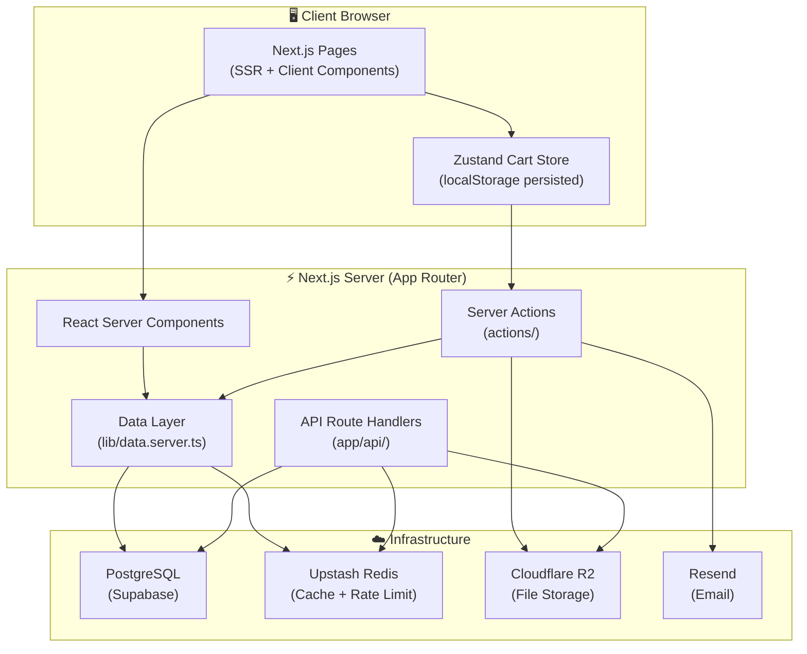
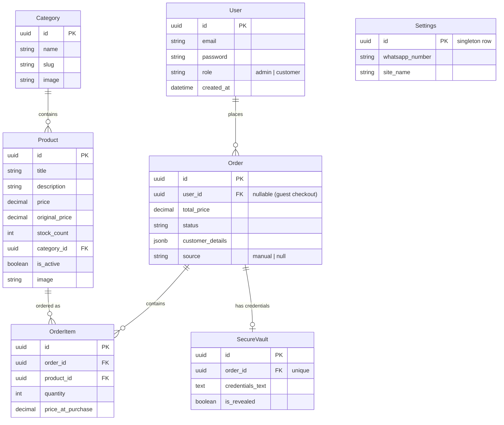
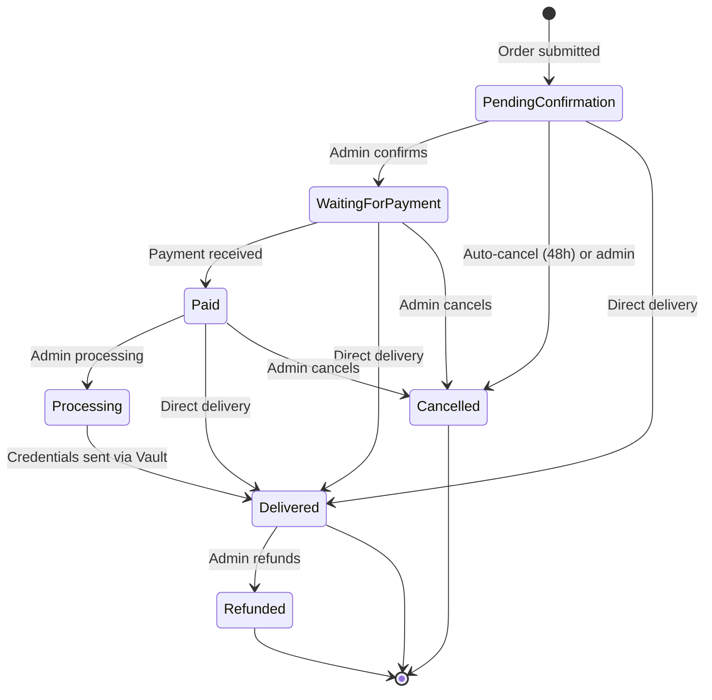
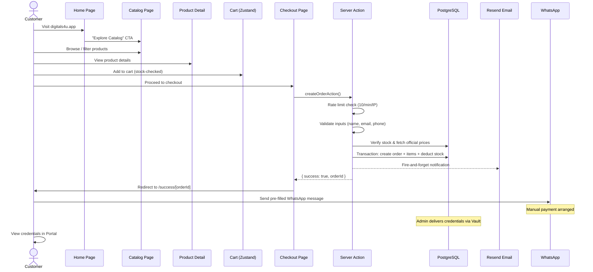
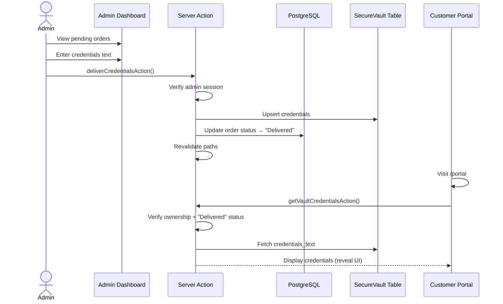

# 🔍 DigitalServices4U — Deep Project Analysis

## 1. Project Overview

**DigitalServices4U** (`digitals4u.app`) is a **premium digital subscription marketplace** built for the **Tunisian market**. It sells access to AI tools (ChatGPT Plus, Midjourney), streaming services (Netflix, Spotify, YouTube Premium), and software subscriptions (Canva Pro) — all priced in **Tunisian Dinar (TND)**.

The business model is **manual fulfillment via WhatsApp**: customers browse, add to cart, submit an order, then contact the seller on WhatsApp to arrange payment (Sobflous, D17, RunPay, or bank transfer). Once paid, the admin delivers credentials through a **Secure Vault** system.

---

## 2. Technology Stack

| Layer | Technology | Version / Details |
|---|---|---|
| **Framework** | Next.js (App Router) | `16.2.9` — standalone output mode |
| **Language** | TypeScript | `^5` |
| **UI** | React | `19.2.4` |
| **Styling** | Tailwind CSS v4 + shadcn/ui | With `tw-animate-css` |
| **State Management** | Zustand | `^5.0.14` — persisted cart store |
| **Database** | PostgreSQL (Supabase-hosted) | Via Prisma ORM `^7.9.0` |
| **DB Adapter** | `@prisma/adapter-pg` | Native `pg` Pool connection |
| **Caching** | Upstash Redis | `@upstash/redis ^1.38.0` |
| **Rate Limiting** | Upstash Ratelimit | `@upstash/ratelimit ^2.0.8` |
| **File Storage** | Cloudflare R2 | Via AWS S3 SDK `^3.1094.0` |
| **Authentication** | Custom JWT (jose) + bcryptjs | Cookie-based sessions, 7-day expiry |
| **Email** | Resend | `^6.17.1` — order notification emails |
| **Animations** | Framer Motion | `^12.40.0` |
| **Icons** | Lucide React | `^1.18.0` |
| **Analytics** | Google Analytics + Meta Pixel | Embedded via `next/script` |
| **Deployment** | Vercel + Docker | Multi-stage Dockerfile, standalone build |
| **Testing** | Vitest | `^4.1.10` |

---

## 3. Architecture Diagram



---

## 4. Directory Structure

```
ecommerce/
├── app/                          # Next.js App Router
│   ├── layout.tsx                # Root layout (metadata, analytics, WhatsApp widget)
│   ├── page.tsx                  # Home: hero video, featured products, FAQs
│   ├── globals.css               # Tailwind v4 + custom design system
│   ├── catalog/page.tsx          # Product catalog with filtering
│   ├── products/[id]/page.tsx    # Individual product detail
│   ├── checkout/page.tsx         # Client-side checkout form
│   ├── success/[id]/page.tsx     # Post-order success page
│   ├── portal/page.tsx           # Customer order portal (credential vault)
│   ├── admin/                    # Admin dashboard
│   │   ├── page.tsx              # Dashboard overview (stats, charts)
│   │   ├── orders/               # Order management
│   │   ├── products/             # Product CRUD
│   │   ├── categories/           # Category CRUD
│   │   ├── manual-orders/        # Manual order creation
│   │   ├── settings/             # Site settings + password change
│   │   └── admin-sidebar.tsx     # Sidebar navigation
│   ├── digitals4uy/page.tsx      # Admin login (hidden URL)
│   ├── refund/page.tsx           # Refund policy page
│   ├── terms/page.tsx            # Terms of service page
│   ├── api/
│   │   ├── auth/login/           # POST login endpoint
│   │   ├── upload/presigned/     # Presigned R2 upload URLs
│   │   └── orders/auto-cancel/   # CRON: auto-cancel stale orders
│   ├── sitemap.ts                # Dynamic sitemap generation
│   ├── robots.ts                 # robots.txt generation
│   └── manifest.ts               # PWA web manifest
│
├── actions/                      # Next.js Server Actions
│   ├── order.ts                  # Customer order creation
│   ├── vault.ts                  # Secure credentials retrieval
│   ├── auth.ts                   # Sign-out action
│   ├── auto-cancel.ts            # Auto-cancel expired orders
│   ├── admin-orders.ts           # Order status, delivery, delete, manual orders
│   ├── admin-products.ts         # Product CRUD, toggle active, image cleanup
│   ├── admin-categories.ts       # Category CRUD with referential checks
│   ├── admin-settings.ts         # WhatsApp number, site name, password change
│   └── index.ts                  # Barrel export
│
├── components/
│   ├── layout/
│   │   ├── header.tsx            # Site header with navigation
│   │   ├── footer.tsx            # Site footer
│   │   └── cart-drawer.tsx       # Slide-out cart drawer (Sheet)
│   ├── ui/                       # shadcn/ui primitives (button, input, etc.)
│   ├── add-to-cart-button.tsx    # Client-side add-to-cart with stock check
│   ├── vault-reveal.tsx          # Secure credential reveal component
│   ├── whatsapp-widget.tsx       # Floating WhatsApp FAB
│   ├── loading-screen.tsx        # Full-screen loading animation
│   └── theme-provider.tsx        # Dark/light theme via next-themes
│
├── lib/
│   ├── auth.ts                   # JWT, bcrypt, session cookies, admin verification
│   ├── cart.ts                   # Zustand store with persistence
│   ├── data.ts                   # Mock data, types, formatCurrency()
│   ├── data.server.ts            # Server data fetchers with Redis caching
│   ├── db.ts                     # Prisma client singleton (PrismaPg adapter)
│   ├── email.ts                  # Resend email notifications (HTML template)
│   ├── r2.ts                     # Cloudflare R2 file operations
│   ├── rate-limit.ts             # Multi-tier rate limiting system
│   ├── redis.ts                  # Cache get/set/invalidate helpers
│   └── utils.ts                  # Utility functions (cn)
│
├── prisma/
│   ├── schema.prisma             # Database schema (7 models)
│   ├── seed.ts                   # Database seeder
│   └── seed-backup.ts            # Backup seeder
│
├── types/index.ts                # Shared TypeScript interfaces
├── supabase/migrations/          # SQL migration with RLS policies
├── scripts/                      # Migration & test scripts
├── Dockerfile                    # Multi-stage production Docker build
└── docker-compose.yml            # Docker Compose configuration
```

---

## 5. Database Schema

The database has **7 models** defined in [schema.prisma](file:///c:/Users/youse/OneDrive/Desktop/ecommerce/prisma/schema.prisma):



### Order Status Lifecycle



> [!IMPORTANT]
> Stock is **deducted at order creation** and **restored on cancel/refund**. The `updateOrderStatusAndStock()` helper in [admin-orders.ts](file:///c:/Users/youse/OneDrive/Desktop/ecommerce/actions/admin-orders.ts) handles bi-directional stock adjustments when orders transition to/from terminal states.

---

## 6. Core Flows — How It Works

### 6.1 Customer Purchase Flow



### 6.2 Admin Credential Delivery Flow



---

## 7. Data Layer & Caching Strategy

The data layer in [data.server.ts](file:///c:/Users/youse/OneDrive/Desktop/ecommerce/lib/data.server.ts) implements a **multi-tier caching strategy**:

| Data | Cache Key Pattern | TTL | Invalidation Trigger |
|---|---|---|---|
| All Products | `products:all` | 5 min | Product CRUD, order creation |
| Filtered Products | `products:filter:{slug\|search\|maxPrice}` | 5 min | Product CRUD, order creation |
| Product Detail | `products:detail:{id}` | 5 min | Product update/delete |
| Categories | `categories:all` | 5 min | Category CRUD |
| Site Settings | `settings:site` | 10 min | Settings update |

### Graceful Degradation

The entire system is designed with a **fail-open philosophy**:

1. **No database?** → Falls back to `MOCK_PRODUCTS` and `MOCK_CATEGORIES` in [data.ts](file:///c:/Users/youse/OneDrive/Desktop/ecommerce/lib/data.ts)
2. **No Redis?** → Cache operations silently return `null` / no-op
3. **No Resend?** → Email skipped, order still succeeds
4. **Rate limit Redis down?** → Allows request through (fail-open)

This is controlled by the `isDatabaseConfigured()` check in [data.ts](file:///c:/Users/youse/OneDrive/Desktop/ecommerce/lib/data.ts#L1-L4) which gates every server function.

---

## 8. Authentication & Security

### Authentication Architecture

| Component | Implementation |
|---|---|
| **Password Hashing** | bcryptjs with 12 salt rounds |
| **Session Tokens** | JWT (HS256) via `jose` library, 7-day expiry |
| **Cookie** | `session-token` — httpOnly, secure in prod, sameSite: lax |
| **Admin Login** | Hidden URL at `/digitals4uy` → `POST /api/auth/login` |
| **Admin Guard** | `verifyAdmin()` checks session role === "admin" |
| **Sign Out** | Clears session cookie, redirects to login |

### Rate Limiting System

The [rate-limit.ts](file:///c:/Users/youse/OneDrive/Desktop/ecommerce/lib/rate-limit.ts) module implements **5 tiers** using Upstash's sliding window algorithm:

| Tier | Limit | Window | Used For |
|---|---|---|---|
| `general` | 100 req | 1 minute | General API protection |
| `login` | 5 attempts | 15 minutes | Auth endpoint |
| `upload` | 20 req | 1 minute | File uploads |
| `order` | 10 req | 1 minute | Order creation |
| `password` | 3 attempts | 1 hour | Password changes |

All identifiers are **SHA-256 hashed** before being used as Redis keys to avoid storing PII.

### Security Features

- **Server-side price calculation** — prices are fetched from the database, never trusted from the client
- **Stock verification** — checked inside a Prisma transaction before order creation
- **Ownership verification** — vault credentials only accessible to the order owner
- **Status gate** — credentials only revealed when order status is "Delivered"
- **Input validation** — email regex, Tunisian phone format (`+216XXXXXXXX` or 8 digits)
- **RLS Policies** — PostgreSQL Row Level Security on all tables (defined in [migration SQL](file:///c:/Users/youse/OneDrive/Desktop/ecommerce/supabase/migrations/20260612000000_init.sql))

---

## 9. File Storage (Cloudflare R2)

The [r2.ts](file:///c:/Users/youse/OneDrive/Desktop/ecommerce/lib/r2.ts) module provides:

| Function | Purpose |
|---|---|
| `uploadFile()` | Server-side upload to R2 |
| `deleteFile()` | Delete object by key or URL |
| `createPresignedUploadUrl()` | Generate temporary PUT URL for browser uploads |
| `createPresignedDownloadUrl()` | Generate temporary GET URL for private files |
| `getPublicFileUrl()` | Construct public URL from object key |

Product images are uploaded via presigned URLs from the admin dashboard, and old images are **cleaned up from R2 after successful database updates** to prevent orphaned files.

---

## 10. Email System

The [email.ts](file:///c:/Users/youse/OneDrive/Desktop/ecommerce/lib/email.ts) module sends **HTML order notification emails** to the store owner using Resend:

- **Trigger**: Fire-and-forget after successful order creation
- **Template**: Dark-themed HTML email with customer details, order items table, and total
- **From**: `orders@digitals4u.app`
- **Never blocks checkout**: The email is called with `.catch()` so failures don't affect the order flow

---

## 11. Client-Side State Management

### Cart Store ([cart.ts](file:///c:/Users/youse/OneDrive/Desktop/ecommerce/lib/cart.ts))

Built with **Zustand + persist middleware** → serialized to `localStorage` under key `digitalservices4u-cart`.

| Method | Behavior |
|---|---|
| `addItem()` | Adds item or increments quantity (respects `stock_count`) |
| `removeItem()` | Removes item by ID |
| `updateQuantity()` | Clamps between `[1, stock_count]` |
| `clearCart()` | Empties cart (called after successful order) |
| `getCartTotal()` | Computes sum of `price × quantity` |
| `getItemCount()` | Computes total item count |

---

## 12. SEO & Marketing

The project implements comprehensive SEO:

| Feature | Implementation |
|---|---|
| **Metadata** | Rich `Metadata` object in [layout.tsx](file:///c:/Users/youse/OneDrive/Desktop/ecommerce/app/layout.tsx) with OpenGraph + Twitter cards |
| **Structured Data** | JSON-LD schemas: FAQPage, Organization, WebSite (in [page.tsx](file:///c:/Users/youse/OneDrive/Desktop/ecommerce/app/page.tsx)) |
| **Sitemap** | Dynamic [sitemap.ts](file:///c:/Users/youse/OneDrive/Desktop/ecommerce/app/sitemap.ts) with static routes + category/product URLs |
| **Robots** | [robots.ts](file:///c:/Users/youse/OneDrive/Desktop/ecommerce/app/robots.ts) allowing all crawlers |
| **Web Manifest** | [manifest.ts](file:///c:/Users/youse/OneDrive/Desktop/ecommerce/app/manifest.ts) for PWA support |
| **Analytics** | Google Analytics (`G-CH4BRNZQCZ`) + Meta Pixel (`1521290238929403`) |
| **ISR** | `revalidate = 60` on the home page for incremental static regeneration |
| **Keywords** | Targeted Tunisian digital subscription keywords |

---

## 13. Admin Dashboard

The admin panel at `/admin` provides a full back-office:

| Section | Route | Capabilities |
|---|---|---|
| **Dashboard** | `/admin` | Revenue stats, order counts, charts |
| **Orders** | `/admin/orders` | View, status management, credential delivery, delete |
| **Products** | `/admin/products` | Create, edit, toggle active, delete (with R2 image management) |
| **Categories** | `/admin/categories` | Create, edit, delete (with referential integrity check) |
| **Manual Orders** | `/admin/manual-orders` | Create Delivered/Refunded orders retroactively |
| **Settings** | `/admin/settings` | WhatsApp number, site name, password change |

---

## 14. Automated Processes

### Auto-Cancel Expired Orders

Defined in [auto-cancel.ts](file:///c:/Users/youse/OneDrive/Desktop/ecommerce/actions/auto-cancel.ts):

- **Trigger**: API route at `/api/orders/auto-cancel` (designed for CRON invocation)
- **Logic**: Finds all `"Pending Confirmation"` orders older than **48 hours**
- **Actions**: Cancels orders and **restores stock** in a single Prisma transaction
- **Also in SQL**: A `auto_cancel_expired_orders()` PostgreSQL function exists in the migration (with a 24-hour threshold)

### Cache Invalidation

After every write operation (order creation, product CRUD, category CRUD), the system:
1. Invalidates relevant Redis cache keys using `cacheInvalidatePattern("products:*")`
2. Calls `revalidatePath()` to bust Next.js ISR caches for affected pages

---

## 15. Deployment Architecture

### Vercel (Primary)
- Standard Next.js deployment with environment variables
- `.vercelignore` excludes unnecessary files

### Docker (Alternative)
- **Multi-stage build** in [Dockerfile](file:///c:/Users/youse/OneDrive/Desktop/ecommerce/Dockerfile):
  1. `deps` stage — installs npm dependencies
  2. `builder` stage — generates Prisma client + builds Next.js
  3. `runner` stage — minimal production image with standalone output
- Runs as non-root `nextjs` user
- [docker-compose.yml](file:///c:/Users/youse/OneDrive/Desktop/ecommerce/docker-compose.yml) maps port 3000

---

## 16. Environment Variables

The project requires these environment variables:

| Variable | Purpose |
|---|---|
| `DATABASE_URL` | PostgreSQL connection string |
| `JWT_SECRET` | Secret for signing JWT session tokens |
| `NEXT_PUBLIC_SITE_URL` | Public site URL for metadata/links |
| `UPSTASH_REDIS_REST_URL` | Upstash Redis HTTP endpoint |
| `UPSTASH_REDIS_REST_TOKEN` | Upstash Redis auth token |
| `R2_ACCOUNT_ID` | Cloudflare account ID |
| `R2_ACCESS_KEY_ID` | R2 access key |
| `R2_SECRET_ACCESS_KEY` | R2 secret key |
| `R2_BUCKET_NAME` | R2 bucket name |
| `R2_PUBLIC_URL` | Public URL base for R2 files |
| `RESEND_API_KEY` | Resend email API key |
| `NOTIFICATION_EMAIL` | Admin email for order notifications |

---

## 17. Design System & UI

- **Theme**: Dark mode default via `next-themes` with `ThemeProvider`
- **Color Palette**: Deep navy/blue primary with gold accents
- **Font**: Custom `Digital-7` font for branding, system sans-serif for body
- **Components**: shadcn/ui base (Button, Input, Label, Sheet, Accordion) + custom components
- **Animations**: 
  - Custom CSS animations (`glow-pulse`, `drift-1/2`, `shimmer`, `float`)
  - Framer Motion for interactive elements
  - `tw-animate-css` for utility animations
- **Loading Screen**: Full-screen branded loading animation via [loading-screen.tsx](file:///c:/Users/youse/OneDrive/Desktop/ecommerce/components/loading-screen.tsx)
- **WhatsApp Widget**: Floating action button on home page with auto-hide tooltip

---

## 18. Key Design Patterns

| Pattern | Where | Why |
|---|---|---|
| **Mock data fallback** | All data fetchers | App works without database for development |
| **Fail-open resilience** | Redis, rate limiting, email | Never block user actions due to infra issues |
| **Server Actions** | All mutations | Type-safe RPC without manual API routes |
| **Singleton pattern** | Prisma client, Redis client | Prevents connection exhaustion in serverless |
| **Transactional integrity** | Order creation, auto-cancel | Stock + order updates are atomic |
| **Optimistic cache invalidation** | After every write | Ensures fresh data without stale reads |
| **Fire-and-forget** | Email notifications | Non-critical side effects don't block main flow |
| **Security-first delete** | R2 file cleanup | Only deletes old files after DB update succeeds |

---

## 19. Testing

- **Framework**: Vitest (`^4.1.10`)
- **Test location**: [lib/__tests__/](file:///c:/Users/youse/OneDrive/Desktop/ecommerce/lib/__tests__)
- **Scripts**: `npm test` (single run), `npm run test:watch` (watch mode)
- **Utility scripts**: [test-redis.ts](file:///c:/Users/youse/OneDrive/Desktop/ecommerce/scripts/test-redis.ts) for Redis connectivity testing

---

## 20. Summary

DigitalServices4U is a **production-grade, full-stack ecommerce platform** purpose-built for selling digital subscriptions in Tunisia. It combines:

- **Modern SSR** with Next.js 16 App Router and React 19
- **Robust data integrity** with Prisma transactions and stock management
- **Multi-layer caching** (Redis + ISR) for performance
- **Enterprise-grade security** with JWT auth, rate limiting, RLS policies, and secure credential vaults
- **Graceful degradation** that keeps the app functional even when infrastructure services are down
- **Manual fulfillment workflow** optimized for WhatsApp-based business operations

The architecture cleanly separates concerns: server components for data fetching, server actions for mutations, Zustand for client state, and a well-organized library layer for infrastructure concerns.
